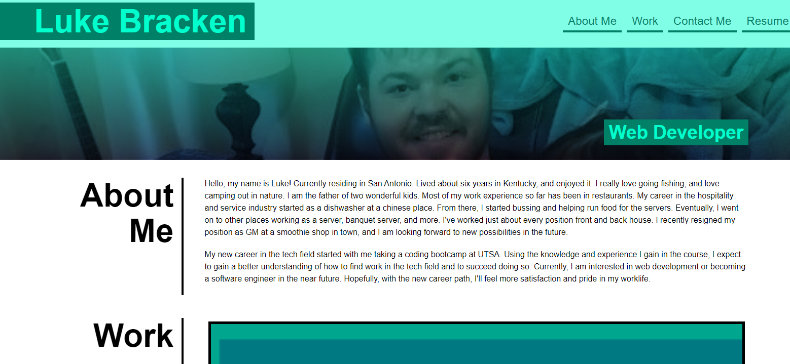

# html-and-css-practice
sample-portfolio-html-and-css-practice-for-learning-purposes
## challenge-webpage
webpage-for-displaying-sample-projects-and-contact-info-for-portfolio
## webpage-description
webpage-is-mainly-used-for-html-and-css-practice-but-there-are-several-working-links-that-display-sample-projects-resume-and-contact-info
## webpage-access
URL: https://brackenluke.github.io/challenge-two/
## repo-access
GitHub URL: https://github.com/brackenluke/challenge-two
## webpage-screenshot
Screenshot: 
